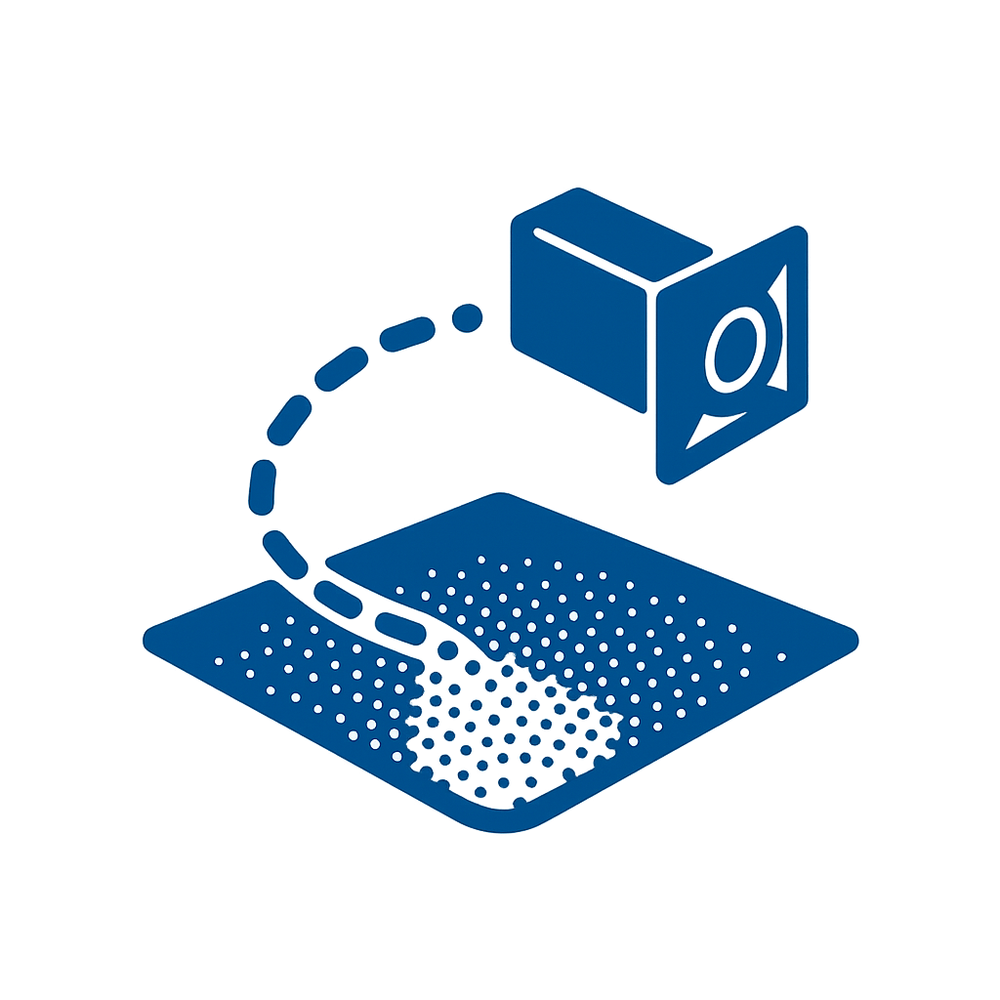

# PoseRunner

  

[[Website]](https://laliane667.github.io/PoseRunner/) 

## Release Status
- [x] 2025/04/04 — 3D scene creation, point cloud loading and visualization (PCD loader).
- [x] 2025/04/06 — Trajectory loading (CSV loader) and camera animation.
- [x] 2025/04/07 — Camera animation smoothing (interpollation between GT poses).
- [x] 2025/04/10 — N-trajectory loading and display.
- [x] 2025/04/14 — File browser for custom point cloud and/or trajectory.
- [ ] Inputs sliders for PC/trajectory voxel size customization.
- [ ] Camera follow offset live adjustments.
- [ ] Pause / reset animation buttons.

# Contact
For questions, please reach out to [Elian Lamouroux](https://github.com/laliane667) (elian.lamouroux@edu.ece.fr).
